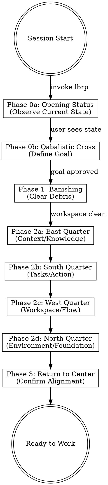
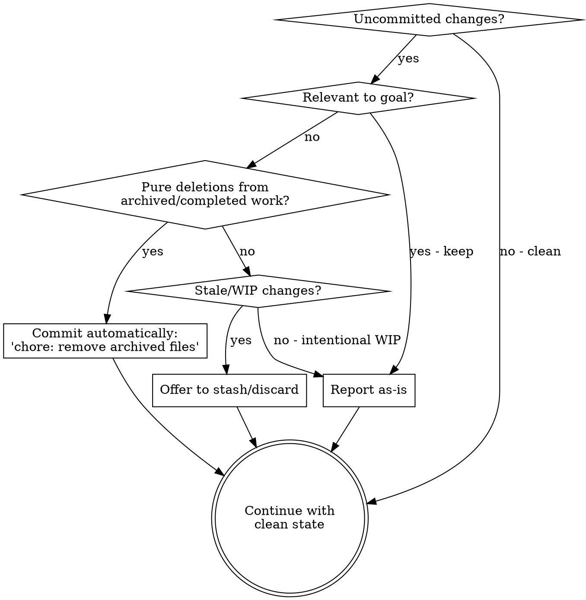
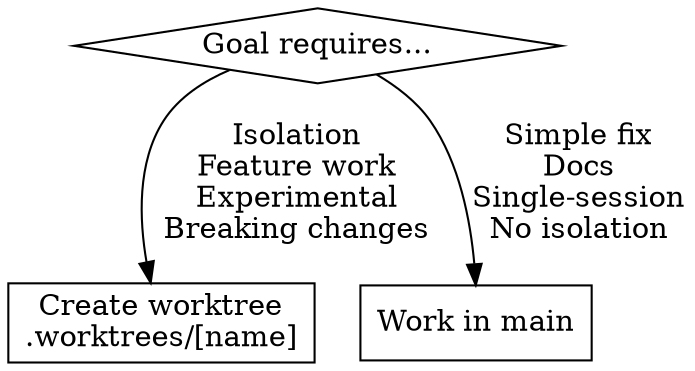

# LBRP: Lesser Banishing Ritual of the Pentagram (Opening Ritual)

## Overview

**The LBRP is the opening ceremony for coding sessions.** It shows current state to inform goal setting, establishes the goal as sacred center, then addresses four quarters radiating from that center, ensuring all aspects of the workspace align with the purpose.

**Core principle:** OBSERVE → Define center → Banish informed by center → Quarters informed by center → Return to confirm alignment.

**This is a ritual.** Follow the structure precisely. The power comes from the pattern, not from rushing to code.

## Structure



## Phase 0a: Opening Status Report (Observation)

**Purpose:** Provide context to inform goal setting. Pure observation, no evaluation yet.

**Both user and model need to see current state before intelligently articulating the goal.**

**Execute systematically:**

```bash
# 1. Git state
git status --short
git log --oneline -5

# 2. Worktrees
git worktree list

# 3. Background processes (relevant ones)
ps aux | grep -E "(flutter|dart|melos|zen|serverpod)" | grep -v grep || echo "None"

# 4. OpenSpec proposals
ls openspec/changes/ 2>/dev/null || echo "No proposals"

# 5. Docker/Environment
docker compose ps 2>/dev/null || echo "No docker-compose"
```

**Report to user:**
```markdown
**Workspace Status** (current state, no evaluation)

Git: [status summary]
Recent commits: [last 5]
Worktrees: [list or none]
Processes: [running services or none]
OpenSpec: [proposals or none]
Environment: [docker status or none]

*Now that you can see what's present, what's the goal for this session?*
```

**DO NOT evaluate or suggest actions yet.** Just show what's present.

---

## Phase 0b: Qabalistic Cross (The Center)

**Purpose:** Establish the sacred center, informed by the observed state.

**Now both user and model have context for an intelligent goal conversation.**

### The Exigence Flow

1. **User provides initial energy** - a statement of what they want, now informed by seeing current state
2. **Model refines** - distill the exigence into a goal statement with just enough detail
3. **User approves** - Goal is determined ONLY when user approves

**The Four Touches (refinement questions):**

1. **Touch Forehead** (Crown): "What is the PURPOSE of this session?"
2. **Touch Heart** (Center): "What does SUCCESS look like?"
3. **Touch Left Shoulder**: "What is IN SCOPE?"
4. **Touch Right Shoulder**: "What is OUT OF SCOPE?"

**Dialog with user to clarify:**
- Vague goal → Ask informed questions (you saw the state)
- Multiple goals → Ask priority
- Unclear success → Ask verifiable criteria
- Scope creep risk → Explicitly bound scope

**Present refined goal for approval:**
```markdown
**Session Goal (Proposed)**

Purpose: [One clear sentence]
Success Criteria: [Verifiable outcomes]
In Scope: [What we're doing]
Out of Scope: [Explicit boundaries]

Does this capture your intent?
```

**CRITICAL:** Do NOT proceed until user approves the goal.

**The center is now established. All subsequent phases are informed by this goal.**

## Phase 1: Banishing

**Purpose:** CLEAR debris, now that we know the goal and can evaluate what's relevant.

**This is a BANISHING ritual - clear the old before invoking the new. We've observed the state (Phase 0a), established the goal (Phase 0b), now we clear what doesn't serve.**

### Banishing Check (Goal-Informed)

**CRITICAL: Evaluate uncommitted changes in light of the GOAL:**



**Banishing actions:**

1. **Pure deletions from archived work:**
   ```bash
   # Auto-commit if ONLY deletions of archived/completed files
   git status --short | grep "^ D" | grep -q "openspec/changes/" && \
   git add -A && \
   git commit -m "chore: remove archived OpenSpec files"
   ```

2. **Stale changes (last modified >24h ago):**
   ```
   Offer: "I see stale changes from [date]. Stash or discard?"
   ```

3. **Intentional WIP relevant to goal:**
   ```
   Report as-is, note in status report
   ```

**Report to user:**
```markdown
**Banishing Complete**

Goal: [The approved goal]
Workspace: [CLEAN / debris acknowledged and kept]

Proceeding to quarters...
```

**CRITICAL:** Do NOT proceed until workspace is CLEAN or debris explicitly acknowledged.

## Phase 2: The Four Quarters

**CRITICAL:** Each quarter's specific form is determined by THE GOAL.

### Phase 2a: East Quarter (Air/Knowledge) - Context

**Element:** Air - Thought, information, knowledge
**Question:** What knowledge does THIS GOAL require?

**Execute (goal-informed):**

1. **Search Private Journal:**
   ```
   Query: [Relevant to goal - past learnings, failures, user preferences]
   Read top 3-5 results if relevant
   ```

2. **Check OpenSpec Status:**
   ```
   If goal involves proposals:
   - Check if completed work should be archived
   - Note dependencies between proposals
   - Verify no conflicts
   ```

3. **Identify Relevant ADRs:**
   ```
   Based on goal, which decisions matter?
   - Architecture patterns needed?
   - Technology choices relevant?
   - Workflow conventions apply?
   ```

4. **Locate Reference Code:**
   ```
   Find existing implementation in same layer
   The goal determines WHICH reference to study
   ```

**Output:** "East Quarter complete. Context loaded: [brief summary]"

### Phase 2b: South Quarter (Fire/Action) - Tasks

**Element:** Fire - Energy, action, will
**Question:** What actions does THIS GOAL require?

**Execute (goal-informed):**

1. **Use Context from East to plan:**
   - Break goal into tasks using TodoWrite
   - Informed by ADRs read
   - Following patterns from reference code
   - Aware of journal learnings

2. **Collaborate with user on breakdown:**
   ```
   Based on [goal], I see these major tasks:
   1. [Task from context]
   2. [Task from context]
   3. [Task from context]

   Does this breakdown align with your vision?
   ```

3. **Create TodoWrite checklist:**
   - Major task breakdown
   - Known sub-tasks
   - Quality verification steps

**Output:** "South Quarter complete. Tasks planned: [X tasks]"

### Phase 2c: West Quarter (Water/Flow) - Workspace

**Element:** Water - Adaptability, flow, the channel
**Question:** What workspace does THIS GOAL need?

**Decision Point (goal-informed):**



**If worktree needed:**
```bash
# Always use .worktrees/ directory
git worktree add .worktrees/[feature-name] -b [branch-name]
cd .worktrees/[feature-name]
git status

# Project-specific setup
melos bootstrap              # Or equivalent
cp ../.env .env             # If needed
```

**If working in main:**
```bash
# Verify clean state
git status
# Ready to work
```

**Output:** "West Quarter complete. Workspace: [main/worktree path]"

### Phase 2d: North Quarter (Earth/Foundation) - Environment

**Element:** Earth - Stability, foundation, material
**Question:** What infrastructure does THIS GOAL need?

**Execute (goal-informed):**

1. **Check required services:**
   ```
   Goal needs database? → Verify PostgreSQL
   Goal needs backend? → Verify Serverpod
   Goal needs frontend? → Verify Flutter
   Goal is docs-only? → No services needed
   ```

2. **Start if needed:**
   ```bash
   docker compose ps

   # If services needed but not running:
   if ! docker compose ps | grep -q "Up"; then
     docker compose up -d
     echo "Started Docker services"
   fi
   ```

3. **Verify health:**
   ```
   Database connections ready?
   Servers responding?
   Health checks passing?
   ```

**Output:** "North Quarter complete. Environment: [services status]"

## Phase 3: Return to Center (Confirmation)

**Purpose:** Verify all quarters align with the center (goal).

**The Questions:**

1. **Does Context (East) support Goal?** - Have we loaded what we need?
2. **Do Tasks (South) achieve Goal?** - Will these actions fulfill purpose?
3. **Does Workspace (West) serve Goal?** - Right channel for the work?
4. **Does Environment (North) ground Goal?** - Foundation stable?

**Confirmation statement:**
```markdown
**The Circle is Complete**

Goal (Center): [Purpose]
East (Context): [Loaded]
South (Tasks): [Planned]
West (Workspace): [Prepared]
North (Environment): [Ready]

All quarters align with center. Ready to begin.
```

**ONLY THEN:** "Session opened. Beginning work."

## When NOT to Use

- Mid-session (already opened)
- Resuming from interrupt (use different protocol)
- Emergency fixes (abbreviated opening acceptable)

## Common Mistakes

| Mistake | Reality |
|---------|---------|
| "Ask user about goal before showing state" | Both user and model need context before intelligent goal setting |
| "Evaluate/banish during Phase 0a" | Phase 0a is pure observation - evaluation comes in Phase 1 after goal is set |
| "Quarters before goal" | Quarters only make sense FROM the goal |
| "Same ritual every time" | Each quarter's form determined by goal |
| "Rush through to code" | Ritual's power is in the structure |
| "Skip user approval on goal" | Goal is determined ONLY when user approves |

## Integration with Other Skills

```
lbrp (opening)
  ↓
TDD cycle (working)
  ↓
zen q (verification)
  ↓
storyline (commit)
  ↓
session-lifecycle closing (when done)
```

---

*The bell rings. The center holds. The quarters radiate.*
